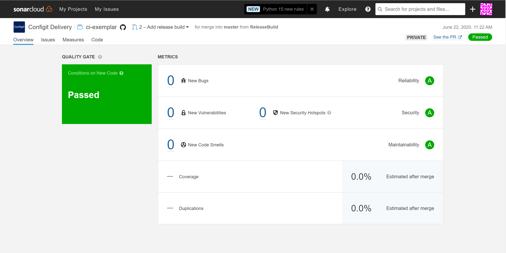

# Continuous Integration exemplar

Welcome to the CI-Exemplar repository. Here you can find code snippets, an example set of Actions workflows and the steps required to construct them. These should help kick start your project into building and releasing using GitHub Actions!

- [Continuous Integration exemplar](#continuous-integration-exemplar)
  - [Where to get started](#where-to-get-started)
  - [Getting Started](#getting-started)
  - [Files of interest](#files-of-interest)
- [Creating Your CI Workflow](#creating-your-ci-workflow)
  - [Setting up a Cake build script](#setting-up-a-cake-build-script)
  - [Getting your Sonar Cloud project set up](#getting-your-sonar-cloud-project-set-up)
  - [The GitHub Actions workflows.](#the-github-actions-workflows)
    - [Workflows](#workflows)
      - [Commit Build](#commit-build)
      - [Mainline Build](#mainline-build)
      - [Release Build](#release-build)
    - [Workflow Summary](#workflow-summary)
  - [Setting up the workflows](#setting-up-the-workflows)
    - [The Commit Build Workflow](#the-commit-build-workflow)
    - [The Release Build workflow](#the-release-build-workflow)
    - [The mainline build workflow](#the-mainline-build-workflow)
- [Help!](#help)

## Where to get started
The point at which you start in implementing the continuous integration practices will depend on where both you and your project are at.

If you have no knowledge of CI or Cake then I would read the whole guide.

If you already understand Cake or don't need to know about it (your repository might already have it's cake script) then I would skip straight to [the GitHub Actions workflows.](#the-github-actions-workflows) and follow the steps to creating your workflows.

If you understand Cake and Actions then I would just read the [the GitHub Actions workflows.](#the-github-actions-workflows) to understand the steps that you should create in your actions script. The sample workflows in this repository can be used for reference.

## Getting Started
For the most part you will likely use most of the workflow files in this repository as part of your build script in one way or another however you will likely need to customise them to an extent depending on your projects requirements. The structure of this sample repository we will be using as part of this tutorial is as follows:

    .
    ├── .github                                  # GitHub specific folder
    |    └── workflows                           # folder to contain all workflows
    |        ├── commitBuild.yaml                # Workflow that runs on commit builds
    |        ├── releaseBuild.yaml               # Workflow that runs on a tagged branch being pushed
    |        └── mainlineBuild.yaml              # Workflow that runs the daily build of master
	|    └── pull_request_template.md            # Template to use when new PR is created
    ├── build                                    # Folder containing all the build artifacts and scripts
    |   ├── artifacts                            # folder for all build artifacts
    |   ├── build.cake                           # The cake script
    |   └── build.ps1                            # A PowerShell bootstrapper for Cake if running locally
    ├── car-reg-ui                               # The sample UI project
    |   ├── build
    |   ├── node_modules
    |   ├── public
    |   └── src                                
    ├── Configit.CarRegistration.API             # The sample .NET Web API solution
    |   ├── Configit.CarRegistration.API
    |   ├── Configit.CarRegistration.Test
    |   ├── Configit.OtherCarRegistration.Test
    |   └── Configit.CarRegistration.API.sln
    └── sonar-project.properties                 # SonarQube project file

## Files of interest

**build.ps1** - This is a bootstrapper script that will ensure you have Cake and any other dependencies required to run your build script installed. This script is also responsible for invoking cake. This file is optional, we won't be using this file as part of the Actions workflow and is just used for running Cake locally. if you would prefer you can install cake via another method (such as [Chocolatey](https://chocolatey.org/)) and then invoke Cake directly from the command line. 

**build.cake** - By default this is the entry point into your build script when cake is called. This can be called anything but you will have to modify your build.ps1/workflow files to account for the change.

# Creating Your CI Workflow

Setting up a CI Workflow will broadly be a three step process. First, creating a Cake build script that will handle all of your building, testing and artifact creation. Second, we will set up a SonarCloud project. Finally, we will create a set of GitHub Actions workflows to initiate this cake script with varying parameters depending on the purpose of the currently running workflow.

While it is possible to complete all of this from within the Actions workflows we have chosen to move all of the non Actions specific functionality into a Cake build script for two reasons:

* We can run a Cake build locally relatively easily. Actions is a lot more work to setup the ability to run locally and isn't always truly representative of the Actions environment

* If we choose to move to another CI platform in future we won't have to 'reinvent the wheel'. We will already have our build logic in a portable format. This will save a lot of effort for projects moving from AppVeyor to GitHub Actions and will yield the same benefits again if we choose to move in future.

## Setting up a Cake build script

To illustrate how we would go about creating these workflows we are going to use the .NET Web API / React front end solution found in this repository.

In addition, for the sake of this example I will be utilising the `build.ps1` to run the Cake script locally. If you would instead like to install Cake onto your machine then please substitute any calls to the `build.ps1` with call to the Cake script directly. 

The sample project structure:

    .
    ├── .github                                  # GitHub specific folder
    ├── img                                      # Folder for storing images for the readme
    ├── car-reg-ui                               # The sample UI project
    |   ├── build                                # The output directory for npm build script artifacts
    |   ├── node_modules                         
    |   ├── public                               
    |   └── src                                
    └── Configit.CarRegistration.API             # The sample .NET Web API solution
        ├── Configit.CarRegistration.API         # The Web API project
        ├── Configit.CarRegistration.Test        # A unit test project
        ├── Configit.OtherCarRegistration.Test   # Second unit test project
        └── Configit.CarRegistration.API.sln     # The solution File


1. Copy the `build.ps1` file found in `build/build.ps1` from this solution into the root of your solution.
2. Create a `build` folder at the root of your project.
3. Create a file called `build.cake`.
4. Open the newly created `build.cake` in your favorite text editor.
5. Copy the following into the editor:

```csharp
// Cake script
// Relies on environment variables
var solutions = GetFiles("../**/*.sln");

//////////////////////////////////////////////////////////////////////
// ARGUMENTS
//////////////////////////////////////////////////////////////////////

var target = Argument( "target", "Build" );
var configuration = Argument( "configuration", "Release" );

//////////////////////////////////////////////////////////////////////
// TASKS
//////////////////////////////////////////////////////////////////////

Task( "EnsureFeeds" )
  .Does( () =>  {
    Information( "Ensure NuGet feeds are set up" );
  } );

// Clean
Task( "Clean" )
  .Does( () => {
	Information( "Clean solution" );
  } );

// RestoreOnly
Task( "RestoreOnly" )
  .Does( () => {
    Information( "Restore NuGet packages" );  
  } );

// NpmRestoreOnly
Task( "NpmRestoreOnly" )
  .Does( () => {
    Information( "Restore NPM Sessions" );
  } );

// BuildOnly
Task( "BuildOnly" )
  .Does( () => {	
	Information( "Build .NET solution" );
  } );

// UiBuildOnly
Task( "UiBuildOnly" )
  .Does( () => {
    Information( "Build UI" );
} );


//////////////////////////////////////////////////////////////////////
// TASKS WITH DEPENDENCIES
//////////////////////////////////////////////////////////////////////

// Restore solution
Task( "Restore" )
  .IsDependentOn( "EnsureFeeds" )
  .IsDependentOn( "Clean" )
  .IsDependentOn( "RestoreOnly" )
  .Does( () => { } );

// Restore and Build solution
Task( "Build" )
  .IsDependentOn( "Restore" )
  .IsDependentOn( "BuildOnly" )
  .IsDependentOn( "NpmRestoreOnly" )
  .IsDependentOn( "UiBuildOnly" )
  .Does( () => { } );


//////////////////////////////////////////////////////////////////////
// Execution
//////////////////////////////////////////////////////////////////////


// Run target task
RunTarget( target );
```

The above code is scaffolding for the build process of the project. We are going to fill this out with an actual implementation. We build up a dependency tree of tasks for this so we can keep our steps separate and so they can be easily reused. We do this by specifying which tasks are required to be run first by chaining `IsDependentOn` to the task. To see how this looks you can run this by running the `build.ps1` from PowerShell. The output should look something like:


6. Implementing this task by task, we will start with the "Restore" tasks. These tasks are in place to ensure that the NuGet on the build server has the correct feeds available, the solution is clean and the relevant NuGet packages have been restored.

7. First the `EnsureFeeds` task will be populated. This is only relevant in our CI environment as these NuGet feeds should already be configured for your local machine. (If they are not, see https://github.com/configit/docs/tree/master/npm) Here we have the Configit-Delivery My-Get feed, the Configit-Sdk feed which has all public packages from Products, and the legacy Configit Products Proget feed - which should be avoided on new projects if at all possible.

``` csharp
Task( "EnsureFeeds" )
  .Does( () =>  {
	if ( GitHubActions.IsRunningOnGitHubActions ) {
      Dictionary<string, NuGetSourcesSettings> settings = new Dictionary<string, NuGetSourcesSettings> {
        { 
          "Configit-Sdk", new NuGetSourcesSettings() {
            UserName  =  EnvironmentVariable("CONFIGIT_SDK_PACKAGES_READ_USERNAME"),
            Password = EnvironmentVariable("CONFIGIT_SDK_PACKAGES_READ_TOKEN"),
            IsSensitiveSource = true,
            Verbosity = NuGetVerbosity.Detailed
          }
        },
        { 
        "Configit", new NuGetSourcesSettings() {
          UserName  =  "bob",
          Password = EnvironmentVariable("BOB_PASSWORD"),
          IsSensitiveSource = true,
          Verbosity = NuGetVerbosity.Detailed
        }
        {   
          "Github", new NuGetSourcesSettings() {
            UserName  =  EnvironmentVariable("GITHUB_ACTOR"),
            Password = EnvironmentVariable("GITHUB_TOKEN"),
            IsSensitiveSource = true,
            Verbosity = NuGetVerbosity.Detailed
          } 
        }
      };

      Dictionary<string, string> feeds = new Dictionary<string, string>() {
        { "configit-delivery", "https://www.myget.org/F/configit-delivery/auth/cc7c219d-131d-42fd-bba5-447cb829dce3/api/v2" },
        { "Configit-Sdk","https://nuget.pkg.github.com/configit-sdk/index.json" },
        { "Configit","http://nuget.configit.com/nuget/Configit/" },
        { "Github","https://nuget.pkg.github.com/configit-services/index.json" },
      };

      foreach (var feed in feeds) {
        if (!NuGetHasSource(feed.Value)) {
          Information("Adding "+feed.Key);
          if (settings.ContainsKey(feed.Key)) {
            NuGetAddSource(feed.Key, feed.Value, settings[feed.Key]);
          } else {
            NuGetAddSource(feed.Key, feed.Value);
          }
        } 
      }
    }
  } );
```

8. For the clean task we will be entirely relying on MSBuild. Copy the following over the top of your `clean` task:

``` csharp
// Clean
Task( "Clean" )
  .Does( () => {
    foreach ( var dir in GetDirectories( "**/obj/*" ) ) {
      CleanDirectory( dir );
    }
    foreach ( var dir in GetDirectories( "**/bin/*" ) ) {
      CleanDirectory( dir );
    }
  } );
```

9. For the `RestoreOnly` task we will then iterate through our solutions, restoring the NuGet packages:

``` csharp
// RestoreOnly
Task( "RestoreOnly" )
  .Does( () => {
	foreach(var solution in solutions) {
      NuGetRestore( solution );
	}
  } );
```

10. You can run and test the `Restore` tasks now. To do this locally, run your `build.ps1 -target Restore`. This should look something like:


11. Next we should tackle the set of tasks the `Build` task is dependent on. It will first run the set of `Restore` tasks we have just defined. Then it will build our .NET solutions, restore our NPM packages and then build our UI. 

12. For the first build task `BuildOnly` we will rely on MSBuild. We will want to add some variables at the top of the build script to be used for versioning our built DLLs and also want Copy the following over the top of your `BuildOnly` task.

```csharp
// Specifies package version directly, setting
// major, minor and patch versions plus suffix
var tag = GitHubActions.Environment.Workflow.Ref;
var buildId = Argument( "build", "0" );
var commit = Argument( "commit", "" );
var majorVersion = "0";
var minorVersion = "0";
var patchVersion = "0";
var version = "1.0.0";
var externalPublish = false; // If true and build type "release" then publish packages to NuGet feed
var suffix = Argument( "suffix", "" );

// Initialize variables according to the Git tag
SetupFromTag( tag );

// Set the environment and the variables according to the tag it is running on
void SetupFromTag( string tag ) {
  var releasePattern = new System.Text.RegularExpressions.Regex( @"((?<type>.+)/)?(?<major>[0-9]+)\.(?<minor>[0-9]+)\.(?<patch>[0-9]+)(?<suffix>-.+)?" );

  if ( releasePattern.IsMatch( tag ?? string.Empty ) ) {
    Information( "Release detected, setting package version..." );
    var matches = releasePattern.Match( tag ?? string.Empty );
    majorVersion = matches.Groups["major"].Value;
    minorVersion = matches.Groups["minor"].Value;
    patchVersion = matches.Groups["patch"].Value;
    suffix = matches.Groups["suffix"].Value;
    if ( !string.IsNullOrEmpty(suffix) && suffix.StartsWith( "-" ) ) {
      suffix = suffix.Substring( 1 );
    }
    if( string.IsNullOrEmpty( suffix ) || suffix.StartsWith( "preview" ) ) {
      externalPublish = true;
    }
    version = $"{majorVersion}.{minorVersion}.{patchVersion}";
  }

  Information( "Package version=" + majorVersion + "." + minorVersion + "." + patchVersion);
  Information( "Version suffix=" + suffix );
}
```

``` csharp
// BuildOnly
Task( "BuildOnly" )
  .Does( () => {	
    foreach(var solution in solutions)	{
    Information("Build solution");
    MSBuild( solution, settings =>
      settings
        .SetVerbosity( Verbosity.Quiet )
        .SetConfiguration( configuration )
        .WithProperty( "MajorVersion", majorVersion )
        .WithProperty( "MinorVersion", minorVersion )
        .WithProperty( "PatchVersion", patchVersion )
        .WithProperty( "BuildVersion", buildId )
        .WithProperty( "VersionSuffix", suffix )
        .WithProperty( "Commit", commit ) );	
    }
  } );
```

13. For the `NpmRestoreOnly` task we simply need to add a reference to an NPM add-in and then make an NPM restore. I'd advise adding this to the top in the same vein as you would add your using statements to the top of a file. In the below example I have specified the UI folder with a relative path. Feel free to change this to a `forEach` of file paths or a non-hardcoded variable if you would prefer.

> When you reference private `@configit` or `@configit-delivery` packages, be sure that your solution has a [`.npmrc`](https://github.com/configit-services/getriebebau-nord/src/nord-quote-web/Plugins/.npmrc) file included. Without that, `@configit` packages will not be restored.

``` csharp
#addin nuget:https://api.nuget.org/v3/index.json?package=Cake.Npm&version=0.17.0
```

``` csharp
// NpmRestoreOnly
Task( "NpmRestoreOnly" )
  .Does( () => {
    NpmInstall( s => s.FromPath( "../car-reg-ui" ) );
  } );
```

14.  Similarly to the `NpmRestoreOnly` task, I have utilised a hardcoded file path for the `UiBuildOnly` and you can modify this as you see fit. The sample solution uses the `react-scripts` set of NPM scripts from [create-react-app](https://github.com/facebook/create-react-app) to build our solution. This should be changed to run whatever scripts you have set up to compile your UI solution.

``` csharp
// UiBuildOnly
Task( "UiBuildOnly" )
  .Does( () => {
    NpmRunScript( "build", config => config.WorkingDirectory = "../car-reg-ui" );
} );
```

15. We can now try and test running the `Build` task. We can do this by running the `build.ps1 -target Build`.


16. Next, we will be adding a new set of tasks to the cake script. As part of any good CI build you will be running your unit tests / front end JS tests. To this end we will add a set of tasks as follows:

``` csharp
// Restore, Build and Test solution
Task( "Test" )
  .IsDependentOn( "Build" )
  .IsDependentOn( "TestOnly" )
  .IsDependentOn( "UiTestOnly" )
  .Does( () =>{ } );
```

17. The first task in this dependency tree, `Build` has been implemented above. The second task `TestOnly` will run the .NET unit tests. You will need to modify the paths where appropriate. Make sure the pattern is the same as inside your workflow.yaml file.

Add the following for .NET core:
``` csharp
// TestOnly
Task( "TestOnly" )
  .DoesForEach( GetFiles( "../**/Configit.CarRegistration.API/*.Test/*.csproj" ), (proj) => {
    var resultsPath = new FilePath( $"{Context.Environment.WorkingDirectory}/artifacts/TestResults-{proj.GetFilenameWithoutExtension()}.xml");
    DotNetCoreTest( 
      proj.FullPath, 
      new DotNetCoreTestSettings() {
        Configuration = "Release",
        Logger = $"nunit;LogFilePath={resultsPath}"
      }
    );
  } )
  .DeferOnError();
```

**or** for .NET Framework we will need to add the NUnit Console runner:

```csharp
#tool nuget:?package=NUnit.ConsoleRunner&version=3.10.0
```
and the task: 
```csharp
// TestOnly
Task( "TestOnly" )
  .DoesForEach( GetFiles( "../**/Configit.CarRegistration.API/*.Test/*.csproj" ), ( fullPath ) => {
    var pattern = fullPath.GetFilenameWithoutExtension();
    var test = $@"../test/**/bin/{configuration}/{pattern}.dll";
    var resultsFile = $"../test/TestResults-{pattern}.xml";

    NUnit3( test, new NUnit3Settings {
      Where = "cat != Explicit",
      Configuration = configuration,
      NoResults = false,
      Workers = 1, // Avoid parellelizing tests as most use the database
      Agents = 1,
      Process = NUnit3ProcessOption.InProcess,
      Results = new[] { new NUnit3Result { FileName = resultsFile } }
    } );        
  } ).DeferOnError();
 ```

 > Note the use of `DoesForEach` and `DeferOnError`. This is so that we can run all of the unit tests and then report all failures at the end. The default functionality of Cake is to end and throw the error on first reaching an exception.

 18. The final step in the set of test tasks is the `UiTestOnly` task. The tests in this solution are running on a slightly customised version of the `react-scripts` test script. Please replace the `NpmRunScript` with the script that runs your unit tests.

 ``` csharp
// UiTestOnly
Task( "UiTestOnly" )
  .Does( () => {
    NpmRunScript( "ciTest", config => config.WorkingDirectory = "../car-reg-ui" );
  } );
 ```

 Running the now completed `Test` task ( `.\build.ps1 -Target Test` ) will look like the below:

 > Note: I have cropped the set of tasks we have already completed for the sake of brevity.

 

 19. Finally we will add the set of `Release` tasks. This will enable us to create and version our artifacts to be used. The initial task dependency setup will look like this:

 ``` csharp
// Restore, Build and Test solution
Task( "Release" )
  .IsDependentOn( "Build" )
  .IsDependentOn( "CreateArtifacts" )
  .Does( () =>{ } );
 ```

 20. The only task here that we need to implement is the `CreateArtifacts` task. For this setup we will need to update the cake script and add some parameters and functions in addition to the task. In the case of this example, I will just be creating a zip file of the artifacts we have created but you may want to instead replace this with your installer or other artifacts.

The new functionality required to setup:
``` csharp
//Ensures environment is clean of any previous build artifacts
CleanEnvironment();

void CleanEnvironment() {
  var dir = "./artifacts";

  if ( !DirectoryExists( dir ) )
  {
    CreateDirectory( dir );
  }
  else {
    DeleteDirectory( dir, new DeleteDirectorySettings {
    Recursive = true
    } );
  }
}
```

 The `CreateArtifacts` task:

 ``` csharp
// Release
Task( "CreateArtifacts" )
  .Does( () =>
  {
    CopyDirectory( "../car-reg-ui/build", "./artifacts/ui" );
    CopyDirectory( "../Configit.CarRegistration.API/Configit.CarRegistration.API/bin/Release", "./artifacts/backEnd" );
    Zip( "./artifacts", $"./artifacts/deploy-v{majorVersion}.{minorVersion}.{patchVersion}.zip" );
  } );
 ```
 
 20b. There is a bug in Cake currently when zipping files. See:
 https://github.com/cake-build/cake/issues/2803 with a workaround and
 https://github.com/cake-build/cake/issues/2832 for the current bug.
 We add the following code just before the Zip command to get around this:
 
 ``` csharp
    var now = DateTime.UtcNow;
   foreach ( var file in GetFiles($"./artifacts/**/*" ) ) {
    System.IO.File.SetLastWriteTimeUtc( file.FullPath, now );
   }
 ```

 21. This should now be a completed Cake Script. For reference you can also find the [completed cake script](build/build.cake) in the repository. If you want to see the full script in use in this project click here.

 ## Getting your Sonar Cloud project set up

SonarQube is a continuous code analysis tool that is designed to integrate with your existing build processes and workflow to assist in the detection of tricky issues, maintain good security standards and improve the maintainability of your codebase by helping to reduce technical debt. It has integrations with the major CI tools such as AppVeyor, TeamCity and Azure DevOps and has built-in integrations for MSBuild and so it should be relatively easy for us to integrate seamlessly with our existing CI pipelines and centralise quality.

The current process for having your project setup in Sonar Cloud in brief is as follows:

1. Contact the CI team either via [teams](https://teams.microsoft.com/l/team/19%3ae4d1dd313248459d86a93f6f23205167%40thread.tacv2/conversations?groupId=ce451471-4e86-45fe-914d-727eace11332&tenantId=5fcb4d51-d75c-4d60-9fc1-6ea222b029b7) or via email <p>[Andy Kimball](mailto:ak@configit.com)</p><p>[Nick Huguenard](mailto:nhuguenard@configit.com)</p> and request creation of your project along with a link to your GitHub repository.

2. The CI team will contact you informing you of the creation of your project along with a link to your project and some properties relating to your project.

3. Utilise the aforementioned properties in your Actions workflow.


 ## The GitHub Actions workflows.

 ### Workflows

For each different type of build, we will need a workflow file. The base three workflows we advise for any project is a `commitBuild`, a `releaseBuild` and a `mainlineBuild`.

#### Commit Build

The Commit Build is run on any open pull request when they are opened, synchronized or reopened. Its main purpose is to run various checks on the code to make sure it’s ready to be integrated. 

The key steps are compiling the code, running tests and performing static checks of the code quality.

#### Mainline Build

The Mainline Build (a.k.a. Daily Build) is run either on a schedule or on-demand. Its purpose depends on the context but is typically to run some more time consuming verification and to deploy the artifacts for testing and evaluation purposes.

This pipeline is of value when the project meets one or more of the following criteria:

* large project

* lots of testable functionality

* solution is testable in isolation


#### Release Build

The Release Build is run on creation of a release tag. Its purpose is to creates release artifacts (e.g. installers) ready for deployment.

The key steps are compiling the code and building the artifacts.

### Workflow Summary

Below is a table outlining the steps each workflow should contain. At the time of writing any build steps marked with asterisks will not be covered as part of the basic setup / getting started but examples can be provided of that upon request.

Pipeline Step | Commit Build | Release Build | Mainline Build
------------  | :------: | :-----------: | :------------: |
**Build** |  
Compile | ✔ | ✔ | ✔ 
Artifact Creation | | ✔ | ✔ 
**Test** |
Unit Test | ✔ | | ✔ |
End-to-end Test | | | ✔*
Performance Test | | | ✔**
**Static Analysis** |
Code standards/Quality | ✔ | | ✔
**Deploy** |
Deploy | | | ✔***
**Github** |
Create Draft Release | | ✔


**the ability to have automated end-to-end tests will be limited by what’s feasible with the external integrations*

***performance tests should be automated where acceptance is based on meeting formal performance requirements*

****the decision whether to deploy (for example to an Azure VM) will depend on whether it's a prerequisite for other build steps or adds value in other ways*


To begin creating the workflows we will need to do some minor folder structure setup. All of this setup has also been done within this repository so feel free to refer to the files and folders in this repository to supplement your work.

## Setting up the workflows

1. Create a `.github` folder at the root of your solution

2. Create a `workflows` folder underneath that.

3. Within the `workflows` folder create the following files:

* `commitBuild.yaml`
* `releaseBuild.yaml`
* `mainlineBuild.yaml`

### The Commit Build Workflow

First, we will tackle the `commitBuild` workflow. For the next few steps we will be working with the `commitBuild.yaml`.

1. The first step in creating any workflow is defining the name of the workflow and its trigger points (what has to happen to make this workflow run). For the commit build we want it to run when a push is made to master (ignoring tags) or a pull request is interacted with under the following statuses:

* `opened` - when the pull request is opened
* `synchronize` - when a new commit is pushed to a branch with an open pull request.
* `reopened` if a closed pull request is reopened


Add the following to your yaml file:
``` yml
# The workflow name

name: CI Build

# Controls when the action will run. Triggers the workflow on pull request events or on non-tag pushes to master

on:
  push:
    branches:
      - 'master'
    ignore-tags:
      - '*'
  pull_request:
    types: [opened, synchronize, reopened]
```

> Note You might want to set up quite a liberal trigger point initially so you can test that workflow on any commit and then change it later on to restrict it to the designated triggers when you're happy with it.

An actions workflow is split into a number of jobs. Each job can contain multiple steps. Similarly to Cake you can make these dependent on one another if required. Jobs can be run in parallel but their steps will always run sequentially.

For our commit build script we will set up two jobs. First, a build job that will handle building and testing our solution followed by a SonarCloud step that will integrate and interact with SonarQube on our behalf.

2. Add the following to your `commitBuild.yaml`. This is the start of the build step. This will state the type of build machine we require (windows in this case) and the actions to checkout our code and setup NuGet.

``` yml
# A workflow run is made up of one or more jobs that can run sequentially or in parallel
jobs:
  build:
    name: Build
    # The type of runner that the job will run on
    runs-on: windows-latest

    steps:
    # Checks-out your repository under $GITHUB_WORKSPACE, so your job can access it
    - uses: actions/checkout@v2
    - uses: actions/setup-dotnet@v1 
    - uses: nuget/setup-nuget@v1
```

3. Next, we will want to add a build step to install the Cake tooling for .NET so we can run the Cake build scripts we created earlier. Second, we will want to run the `build.cake` with the target `test`. This will build our code, run our unit tests and provide test results as xml files (we will be using those later).

``` yml
- name: Install cake tool for dotnet core
      run: dotnet tool install --global Cake.Tool --version 0.37.0

- name: Cake Script 
  env:
    CONFIGIT_SDK_PACKAGES_READ_TOKEN: ${{ secrets.CONFIGIT_SDK_PACKAGES_READ_TOKEN }}
    CONFIGIT_SDK_PACKAGES_READ_USERNAME: ${{ secrets.CONFIGIT_SDK_PACKAGES_READ_USERNAME }}
    BOB_PASSWORD: ${{secrets.BOB_PASSWORD}}
    GITHUB_TOKEN: ${{ secrets.GITHUB_TOKEN }}
  run: dotnet-cake "./build/build.cake"--target=Test
```
> You may notice the three environment variables, `secrets.CONFIGIT_SDK_PACKAGES_READ_TOKEN`, `secrets.CONFIGIT_SDK_PACKAGES_READ_USERNAME`, `secrets.BOB_PASSWORD`, and `secrets.GITHUB_TOKEN`. The secrets `CONFIGIT_SDK_PACKAGES_READ_TOKEN`, `CONFIGIT_SDK_PACKAGES_READ_USERNAME`, and `BOB_PASSWORD` are organization wide secrets and the `GITHUB_TOKEN` is a pre-defined secret that you can use to interact with the GitHub APIs. The `CONFIGIT_SDK_PACKAGES` tokens are those neccessary to access the Configit-Sdk feed, where as the `BOB_PASSWORD` is the password secret for the legacy Products ProGet feed - which, again, should be avoided if at all possible.

4. We will now add two additional steps to provide unit test and UI test results in the *checks* section. The actions I will be using in this example will be using an NUnit reporter for the C# tests and a Jest Reporter for the UI tests. If your tests aren't using NUnit/Jest respectively then your mileage may vary in these steps working. I have included an alternative where you could instead upload the XMLs in an artifacts zip file.

The steps:

``` yml
- name: Report Test Results
  uses: MirageNet/nunit-reporter@v1.0.9
  if: always()
  with:
    path: "**/TestResults-*.xml"
    access-token: ${{ secrets.GITHUB_TOKEN }} 

- name: Report JS Test Results
  uses: IgnusG/jest-report-action@v2.3.3
  if: always()
  with:
    junit-file: "../build/artifacts/junit-report.xml"
    access-token: ${{ secrets.GITHUB_TOKEN }}
    working-directory: "./car-reg-ui"
```

The Jest results output:


The Unit test results output:


The alternative if you aren't using the above:

``` yml
- uses: actions/upload-artifact@v2
  with:
    name: Client Test Results
    path: ../build/artifacts/junit-report.xml
```

The upload artifacts alternative:


With this the build job in the `commitBuild.yaml` is finished. If you were to upload this it should build your code, run your unit tests and report your test results.

Next we will add SonarQube into our build pipeline.

> To complete this step your project will need to have been setup in Sonar Cloud. 

5. As part of the setup process you will have been sent a Sonar token. This should be added to your GitHub repository (permissions for this require you to be admin of the repository). In this repository and below example I have called the secret `SONAR_TOKEN`. If you choose a different name then please substitute it in the below code snippet as well.


6. Add the following job to your `commitBuild.yaml`:

``` yml
  sonarcloud:
    name: SonarCloud Scan
    needs: build
    runs-on: windows-latest
    steps:
      - uses: actions/checkout@v2
        with:
          fetch-depth: 0  # Shallow clones should be disabled for a better relevancy of analysis

      - name: Setup Configit-Sdk nuget Sources
        shell: powershell
        run: dotnet nuget add source "https://nuget.pkg.github.com/configit-sdk/index.json" -n "Configit-Sdk" -u "${{secrets.CONFIGIT_SDK_PACKAGES_READ_USERNAME}}" -p "${{ secrets.CONFIGIT_SDK_PACKAGES_READ_TOKEN }}" --store-password-in-clear-text
      
      - name: Setup Configit nuget Sources
        shell: powershell
        run: dotnet nuget add source "http://nuget.configit.com/nuget/Configit/" -n "Configit" -u "bob" -p "${{ secrets.BOB_PASSWORD }}" --store-password-in-clear-text
      
      - name: Restore NPM Packages
        shell: cmd
        run: cd D:/a/ci-exemplar/ci-exemplar/car-reg-ui && npm install

      - uses: actions/checkout@v2                            
        with:
          repository: configit-services/sonarcloud-dotnet-scanner-action
          token: ${{ secrets.BISHOP_PRIVATE_ACTION_ACCESS_TOKEN }}                
          path: .github/actions         

      - uses: actions/setup-java@v1.4.3
        with:
          java-version: '13.0.2' # Step required as default java version in the runner is deprecated for use with SQ    
                       
      - name: Sonar Scan 
        uses: ./.github/actions     
        with:
          buildCommand: dotnet build ./Configit.CarRegistration.API/Configit.CarRegistration.API.sln /t:Rebuild
          projectKey: configit-services_ci-exemplar
          sonarToken: ${{ secrets.SONAR_TOKEN }}
          githubToken: ${{ secrets.GITHUB_TOKEN }}
          beginArguments: >
            /d:sonar.verbose="true" 
            /d:sonar.projectBaseDir="D:/a/ci-exemplar/ci-exemplar" 
            /d:sonar.sources="D:/a/ci-exemplar/ci-exemplar/car-reg-ui"
```

To break down what the above job is doing and which bits you need. The steps fulfill the following purpose(s):
  1. `Setup NuGet Sources` - Sets up the Configit Nuget Source (only required if your solution requires packages from the Configit Nuget).
  2. `Restore NPM Packages` - Restoring the NPM packages for the solution extenal to the .NET solution. This is only required if you have a JS based solution with NPM packages that exists outside of your .NET solution. If you require this then you will need to replace the path in the `run` parameter to match your solutions path.
  3. `Sonar Scan` - This is the major step that will actually build and scan your code and then interface with SonarQube to report the result. The parameters of this step will need to be modified per project as follows:
   - `buildCommand`: This is the CLI dotnet command for building your solution. You will need to update the path and command where appropriate to your situation.
   - `projectKey`: This is the key for your project and will be provided for you as part of the setup
   - `sonarToken`: The token for your Sonar Scan. This should be a secret that you set up earlier in this process.
   - `githubToken`: The Github token for this run.
   - `beginArguments`: `projectBaseDir` and `sources` are only required if you want to include files in your scan that are in addition and not included in your .NET solution.

7. This will add a SonarCloud scanning step to your build. This can be viewed in the following:

The Checks screen:

The pull request conversation:

In Sonar Cloud:


This should be the end of the `commitBuild.yaml`. You can refer to the [commitBuild.yaml](.github/workflows/commitBuild.yaml).

### The Release Build workflow
Next we will move onto the `releaseBuild` workflow. For the next few steps we will be working with the `releaseBuild.yaml`.
1. First, we will define the name of the workflow and the release build triggers. These are as follows:

``` yml
name: Publish

# Controls when the action will run. Triggers the workflow on push of a tag matching the format v*.*.*
on:
  push:
    tags:
      - 'v*.*.*'
```

2. We will then need to add the git checkout and .NET setup steps as in the `commitBuild`:

``` yml
# A workflow run is made up of one or more jobs that can run sequentially or in parallel
jobs:
  build:
    # The type of runner that the job will run on
    runs-on: windows-latest

    steps:
    # Checks-out your repository under $GITHUB_WORKSPACE, so your job can access it
    - uses: actions/checkout@v2
    - uses: actions/setup-dotnet@v1 
    - uses: nuget/setup-nuget@v1

    - name: Install cake tool for dotnet core
      run: dotnet tool install --global Cake.Tool --version 0.37.0
```
3. Next we will need to add some steps to extract the version string from the GitHub tag so we can use it in future steps to version our artifacts:

``` yml
- name: Get Tag
      shell: bash
      run: |
        echo "RELEASE_VERSION=$( echo $GITHUB_REF | cut -b12- )" >>  $GITHUB_ENV
    - name: Set Version
      shell: bash
      run: |
        echo "Major=$( echo $RELEASE_VERSION | cut -d. -f1 )" >> $GITHUB_ENV
        echo "Minor=$( echo $RELEASE_VERSION | cut -d. -f2 )" >> $GITHUB_ENV
        echo "Revision=$( echo $RELEASE_VERSION | cut -d. -f3 )" >> $GITHUB_ENV
        echo "SemVerSuffix=$( echo $RELEASE_VERSION | cut -d. -f4 )" >> $GITHUB_ENV
```

4. Then we can add the cake build script with the `release` target. This will construct and version our artifacts.

``` yml
- name: Cake Script 
  env:
    CONFIGIT_SDK_PACKAGES_READ_TOKEN: ${{ secrets.CONFIGIT_SDK_PACKAGES_READ_TOKEN }}
    CONFIGIT_SDK_PACKAGES_READ_USERNAME: ${{ secrets.CONFIGIT_SDK_PACKAGES_READ_USERNAME }}
    GITHUB_TOKEN: ${{ secrets.GITHUB_TOKEN }}
  run: dotnet-cake "./build/build.cake"--target=Release
```

5. This next step will depend on how you want to release your artifacts. In this example I am going to create a draft GitHub release. To do this copy the below:

``` yml
- name: Create Release
  id: create_release
  uses: ncipollo/release-action@v1
  with:
    name: Actions Test Release v${{ env.RELEASE_VERSION }}
    artifacts: ./build/artifacts/deploy-v${{ env.Major }}.${{ env.Minor }}.${{ env.Revision }}.zip
    draft: true
    prerelease: false
    token: ${{ secrets.GITHUB_TOKEN }}
    body: |
      ## Ci Exemplar - ${{ env.RELEASE_VERSION }}
      Release notes here.
```

This release will look like:


This should be the end of the `releaseBuild.yaml`. You can refer to the [releaseBuild.yaml](.github/workflows/releaseBuild.yaml).

### The mainline build workflow
Next we will move onto the `mainlineBuild` workflow. For the next few steps we will be working with the `mainlineBuild.yaml`.

1. First, we will define the name of the workflow and the build triggers. These are as follows:

``` yml
# This is a basic workflow to help you get started with Actions

name: Mainline Build

# Controls when the action will run. Triggers the workflow daily
on:
  schedule:
  # runs every weekday at 3am
  - cron:  '0 3 * * 1-5'
```

2.  Similarly to the previous workflows we will add a ref parameter to the checkout to ensure we always checkout `master`.

``` yml
# A workflow run is made up of one or more jobs that can run sequentially or in parallel
jobs:
  build:
    name: Build
    # The type of runner that the job will run on
    runs-on: windows-latest

    steps:
    # Checks-out your repository under $GITHUB_WORKSPACE, so your job can access it
    - uses: actions/checkout@v2
      with:
        ref: master
    - uses: actions/setup-dotnet@v1 
    - uses: nuget/setup-nuget@v1
```

3. Aside from this it will look almost identical to the `commitBuild` from earlier. While it is not shown in this example as part of your mainline build you may have a deploy step to deploy to a daily environment. Add the following to the end of the `mainlineBuild.yaml`:

``` yml
  - name: Install cake tool for dotnet core
    run: dotnet tool install --global Cake.Tool --version 0.37.0

  - name: Cake Script 
    env:
      CONFIGIT_SDK_PACKAGES_READ_TOKEN: ${{ secrets.CONFIGIT_SDK_PACKAGES_READ_TOKEN }}
      CONFIGIT_SDK_PACKAGES_READ_USERNAME: ${{ secrets.CONFIGIT_SDK_PACKAGES_READ_USERNAME }}
      BOB_PASSWORD: ${{secrets.BOB_PASSWORD}}
      GITHUB_TOKEN: ${{ secrets.GITHUB_TOKEN }}
    run: dotnet-cake "./build/build.cake"--target=Test

  - name: Report Test Results
    uses: MirageNet/nunit-reporter@v1.0.9
    if: always()
    with:
      path: "**/TestResults-*.xml"
      access-token: ${{ secrets.GITHUB_TOKEN }} 

  - name: Report JS Test Results
    uses: IgnusG/jest-report-action@v2.3.2
    if: 
    with:
      junit-file: "../build/artifacts/junit-report.xml"
      access-token: ${{ secrets.GITHUB_TOKEN }}
      working-directory: "./car-reg-ui"
  sonarcloud:
    name: SonarCloud Scan
    needs: build
    runs-on: windows-latest
    steps:
      - uses: actions/checkout@v2
        with:
          fetch-depth: 0  # Shallow clones should be disabled for a better relevancy of analysis

     - name: Setup Configit-Sdk nuget Sources
        shell: powershell
        run: dotnet nuget add source "https://nuget.pkg.github.com/configit-sdk/index.json" -n "Configit-Sdk" -u "${{secrets.CONFIGIT_SDK_PACKAGES_READ_USERNAME}}" -p "${{ secrets.CONFIGIT_SDK_PACKAGES_READ_TOKEN }}" --store-password-in-clear-text
      
      - name: Setup Configit nuget Sources
        shell: powershell
        run: dotnet nuget add source "http://nuget.configit.com/nuget/Configit/" -n "Configit" -u "bob" -p "${{ secrets.BOB_PASSWORD }}" --store-password-in-clear-text
      
      - name: Restore NPM Packages
        shell: cmd
        run: cd D:/a/ci-exemplar/ci-exemplar/car-reg-ui && npm install

      - uses: actions/setup-java@v1.4.3
        with:
          java-version: '13.0.2' # Step required as default java version in the runner is deprecated for use with SQ    
  

      - uses: actions/checkout@v2                            
        with:
          repository: configit-services/sonarcloud-dotnet-scanner-action
          token: ${{ secrets.BISHOP_PRIVATE_ACTION_ACCESS_TOKEN }}                
          path: .github/actions                              
      - name: Sonar Scan
        uses: ./.github/actions     
        with:
          buildCommand: dotnet build ./Configit.CarRegistration.API/Configit.CarRegistration.API.sln /t:Rebuild
          projectKey: configit-services_ci-exemplar
          sonarToken: ${{ secrets.SONAR_TOKEN }}
          githubToken: ${{ secrets.GITHUB_TOKEN }}
          beginArguments: >
            /d:sonar.verbose="true" 
            /d:sonar.projectBaseDir="D:/a/ci-exemplar/ci-exemplar" 
            /d:sonar.sources="D:/a/ci-exemplar/ci-exemplar/car-reg-ui"
```
You will need to modify the `SonarCloud Scan` job with the same parameters used in your `commitBuild.yaml`.
This concludes the setup of the `mainlineBuild.yaml` setup. You can refer to the [mainlineBuild.yaml](.github/workflows/mainlineBuild.yaml).

# Help!

If you need any further information then in the first instance consult the [Cake Documentation](https://cakebuild.net/docs/) or [GitHub Actions documentation](https://help.github.com/en/actions) to see if it answers your question.

Failing that contact your local CI office representative(s). We also have a team on [Microsoft Teams](https://teams.microsoft.com/l/team/19%3ae4d1dd313248459d86a93f6f23205167%40thread.tacv2/conversations?groupId=ce451471-4e86-45fe-914d-727eace11332&tenantId=5fcb4d51-d75c-4d60-9fc1-6ea222b029b7). It is also worth looking at the contributors of this repository as it's quite likely people that have contributed have knowledge of Cake/Actions and can help you out.
